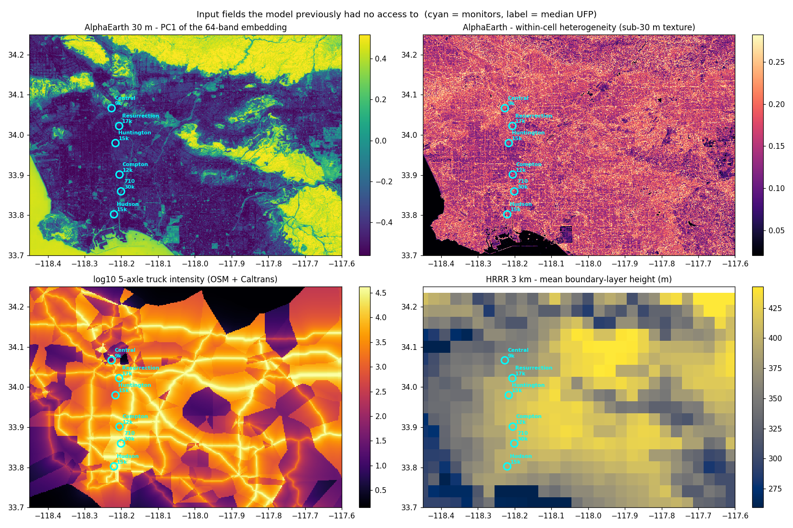
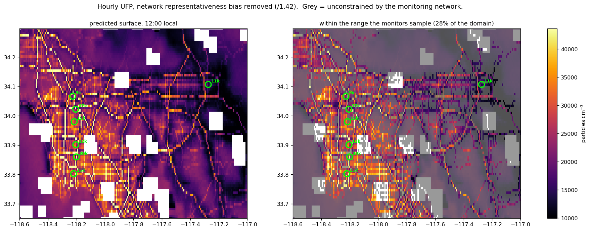
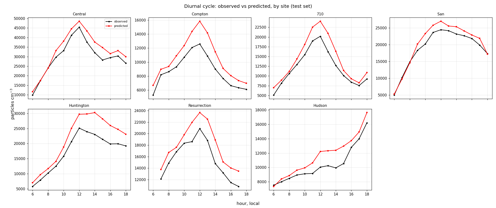
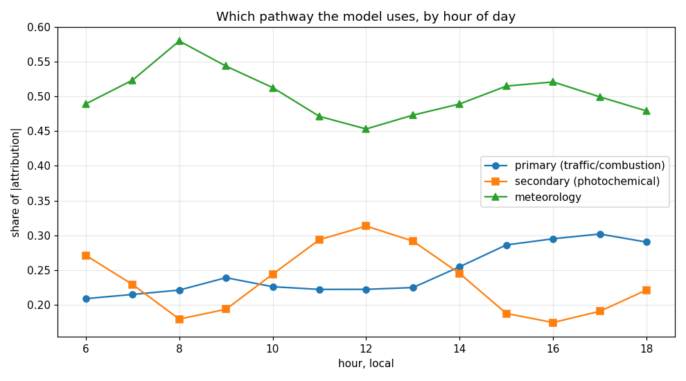
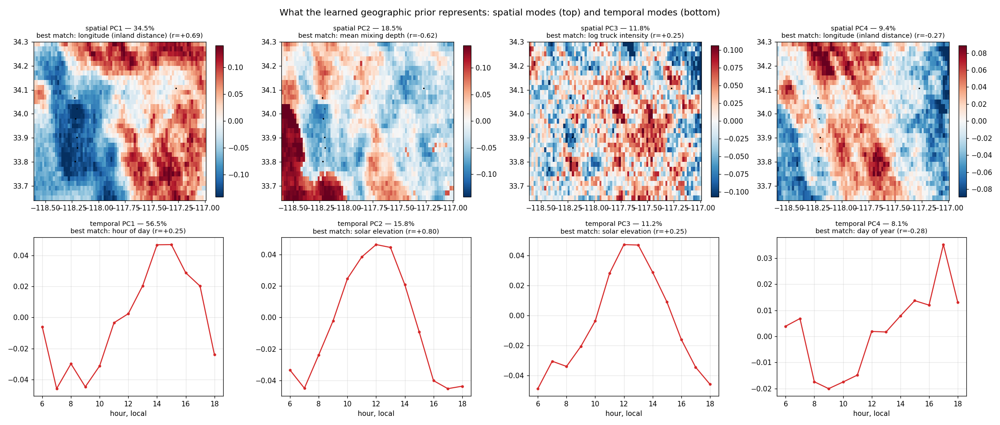
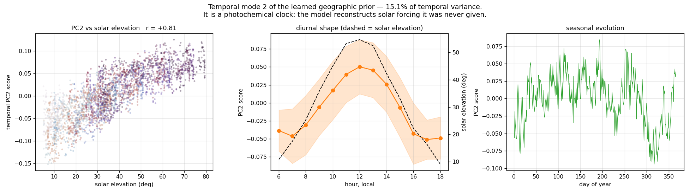
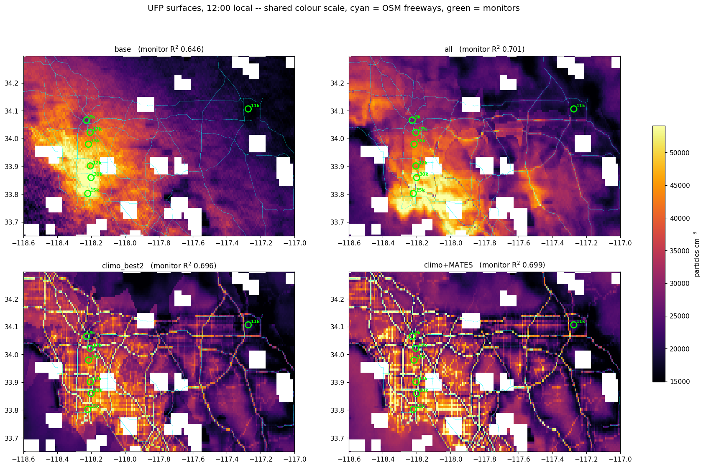
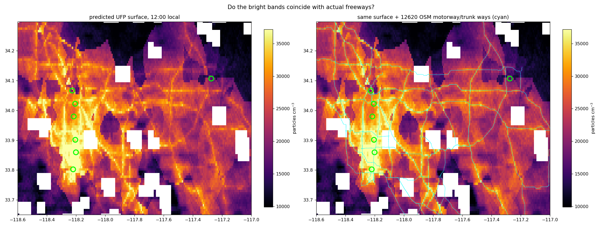

# Hourly ultrafine particle prediction over the Los Angeles basin

**A proxy-consistency model with an explicit spatial climatology, and what it can and
cannot support**

---

## 1. Problem

Ultrafine particles (UFP, diameter < 100 nm) are measured as total particle number
concentration. Unlike PM2.5 they are dominated by fresh combustion emissions and by
photochemical new-particle formation, both of which vary over hundreds of metres and over
minutes. They are not a criteria pollutant, so the monitoring network is sparse.

We have hourly total particle number from **seven** South Coast AQMD AB-617 stations in
the Los Angeles basin, 2 August 2023 to 18 June 2025, and we want hourly concentrations
across the basin. Site medians span 8,800 to 30,000 cm⁻³ — a factor of 3.4 across seven
points, with the highest at a freeway-adjacent station on the I-710 port drayage corridor
and the lowest at an urban background site 25 km away.

The modelling question is therefore not "can we fit seven time series" but "what can seven
points constrain about a 150 × 80 km field".

---

## 2. Data

| source | resolution | role |
|---|---|---|
| SCAQMD AB-617 | 7 sites, hourly | target (total particle number) |
| TEMPO L3 | 0.02°, daylight | NO₂ and HCHO vertical columns |
| HRRR analyses | 3 km, hourly | boundary-layer height, winds, temperature, humidity, radiation, cloud |
| ERA5 | 0.25°, hourly | surface meteorology |
| GEOS-CF | 0.25°, hourly | surface CO, O₃, SO₂, NOy, VOCs, PM2.5 speciation |
| MERRA-2 | 0.5°, hourly | black carbon, organic carbon, sulphate, dust, sea salt |
| GOES-ABI | 2 km, daylight | aerosol optical depth (proxy target) |
| AlphaEarth | 30 m, annual | learned land-surface embedding |
| OpenStreetMap + Caltrans | ~200 m, static | road network, traffic and truck volumes |
| SCAQMD MATES V | 10 sites, hourly, 2018-19 | independent historical UFP |



**Figure 1.** Four of the high-resolution inputs, over the monitored part of the basin.
Top left: the leading component of the 30 m land-surface embedding, separating the
urbanised plain from terrain and water. Top right: within-cell variability of that
embedding, in which the freeway network is directly visible. Bottom left: five-axle truck
intensity from road geometry and highway traffic counts. Bottom right: mean modelled
mixing depth at 3 km, showing the coastal-to-inland gradient that a 25 km reanalysis
cannot resolve. Cyan circles mark the seven monitors, labelled with median concentration.

Two properties of this collection shaped the modelling more than anything else.

**The predictors barely resolve the network.** Of the 38 gridded predictors we began with,
**34 take three or fewer distinct values across the seven monitors**, because ERA5 and
GEOS-CF are 0.25° and MERRA-2 is coarser. Six of the seven stations fall in a single
MERRA-2 cell. Only the TEMPO columns distinguish all seven. A model given that stack can
separate the sites only through the location encoder, which with seven coordinates means
memorisation.

**The chosen proxy carries little target information.** GOES AOD is column-integrated
extinction, dominated by accumulation-mode particles. Across our sites its correlation
with mean particle number is **+0.004**, and it is retrievable in only 12.9% of
space–time cells (daylight, cloud-screened). We tested TEMPO NO₂ (|r| = 0.55, 33.9%
coverage), both together, and a four-target combination; none outperformed AOD, and a
no-proxy control was statistically indistinguishable from all of them. In this basin the
proxy-consistency term is not where the predictive leverage lies. We retain it because it
costs nothing and regularises the location encoder, but we would not claim it as the
source of skill here.

---

## 3. Final model

We predict the base-10 logarithm of particle number as a sum of two terms:

```
log10 N(place, time) = climatology(place) + anomaly(chemistry, meteorology, time)
```

The **climatology** is a ridge regression on *site means*, with at most two terms selected
by leave-one-site-out among static land-surface predictors. It is fitted on training sites
only, so under spatial cross-validation the held-out station contributes nothing to its
own climatology. Coefficients are constrained to physically admissible signs (more road,
more traffic → higher concentration; greater distance from a road → lower). Predictions
are clipped to the observed site range plus a margin.

The **anomaly** is the two-branch architecture of the proxy-consistency framework: an
observation encoder over the gridded chemistry and meteorology, a location–time encoder
(equal-area projection, multi-scale random Fourier features, cyclic time harmonics), a
prediction head over the concatenation, and a proxy head on the location branch alone
carrying the consistency loss against GOES AOD (λ = 1, ρ = 16).

### Why this decomposition

Decomposing the model's error shows **4.5% is between-site bias and 95.5% is within-site,
hour-to-hour scatter**. Those are different problems with different amounts of evidence:
the between-site part is seven numbers, the within-site part is ~29,000 hourly samples.
Training a single network on both let a 2.1 M-parameter location branch chase the
between-site part with hourly supervision, and what it learned was which of seven
coordinates it was looking at — validation error reached its minimum at epoch 2 and rose
thereafter.

Fitting the spatial mean separately, on site means, with one or two regularised terms,
solves the same problem with four orders of magnitude fewer parameters and better
out-of-sample behaviour. The network is then free to spend capacity on the 95.5% it is
suited to.

### Other choices that mattered

**Decoupled weight decay on the location branch.** Removing that branch entirely delays
the validation minimum from epoch 2 to epoch 32 — it is demonstrably the component that
overfits — but costs 0.10 in test R², so it must be constrained rather than deleted.
Dropout, coordinate jitter, coarser basis functions and a four-fold smaller branch all
failed. Weight decay of 8 applied to the location parameters alone (against 0.1
elsewhere) gave +0.018 ± 0.014 in test R² over three random seeds and halved the
seed-to-seed variance. A single global value cannot do this: raising it enough to
discipline 2.1 M location parameters also degrades the 0.5 M observation and head
parameters, which are not misbehaving.

**Traffic enters both terms.** Road and traffic variables inform the climatology *and* the
observation encoder. Restricting them to the climatology costs 0.14 in spatial
cross-validated R², because an additive climatology can express "this place is busier" but
only the observation encoder can express "busy roads matter more when the boundary layer
has collapsed".

**Analysis domain clipped to the land-surface embedding.** The embedding field is sampled
with border padding, so outside its extent the model silently reuses edge values. The
domain is restricted accordingly.

**Daylight only.** TEMPO and GOES retrieve in daylight; training on night hours would feed
the observation encoder fill values.

---

## 4. Evaluation

Three protocols, because they answer different questions and disagree.

### 4.1 Temporal hold-out (all sites present)

Weekly blocks assigned round-robin so every split spans every season. A single contiguous
cut over a 22-month record makes validation winter-only and test spring-only, and the
basin has a real seasonal cycle (August median 18,850 cm⁻³, December 11,790).

| | value |
|---|---|
| test R² (log₁₀) | **0.699** |
| test R² (native units) | **0.630** |
| Pearson r | 0.838 |
| Spearman ρ | 0.840 |
| mean bias | +0.011 log₁₀ |

The climatology alone reaches R² 0.237 on the same split, so the network contributes 0.46.

### 4.2 Leave-one-site-out

Seven folds, three seeds. The held-out station contributes nothing, including to its own
climatology.

| model | R² | pattern r |
|---|---|---|
| full model | **−0.195 ± 0.057** | 0.535 |
| without traffic and land-surface embedding | −0.510 ± 0.050 | 0.500 |

Adding the high-resolution predictors improves spatial cross-validation by
**+0.315 ± 0.017** (all three seeds), but the absolute value remains negative — prediction
at an unseen station is worse than using the training mean.

The decomposition of that failure is the useful part. Pattern correlation at held-out
stations is **0.50–0.54 and stable across every fold**, while the mean level is wrong by a
factor of about 1.4. Since single-site R² is scored against that site's own mean, a
constant offset destroys it even when the temporal structure is right. **Relative
spatio-temporal structure transfers between stations; absolute concentration does not.**

### 4.3 Independent validation against a historical network

MATES V measured hourly particle number at ten basin sites in 2018–19 with a
water-condensation particle counter. Six are at locations outside our network. Spatial
pattern between MATES IV (2012–13) and MATES V (2018–19) correlates at r = +0.93 with no
basin-wide level change, and MATES V against our record at r = +0.81 with a uniform 0.81×
decline — so the spatial pattern is a persistent feature of the landscape and the
historical sites are legitimate constraints.

Evaluated at those six sites, averaging 300 daylight hours:

| | over-prediction | rank correlation |
|---|---|---|
| full model | 1.37× | −0.28 |
| chemistry + meteorology only | 1.36× | +0.15 |

**Two findings, both negative, both important.**

*The models over-predict by 36–52% at unmonitored background locations.* This is a
property of the sample, not the architecture. The seven regulatory stations have a
daylight geometric mean of 14,602 cm⁻³ against 10,299 at the six independent background
sites — they are sited at populated and near-road locations and run **1.42×** high. A
model fitted on them reproduces that level everywhere, and the measured over-prediction
matches the sampling ratio. We therefore report a measured representativeness correction
rather than leaving it implicit.

*No land-surface predictor orders unseen background sites correctly.* Fitting the
climatology on the seven stations and testing on the six independent sites gives negative
rank correlation for **every** predictor and combination tried — road density, truck
intensity, traffic volume, the land-surface embedding, and pairs of them. A
bias-corrected constant beats every model there (RMSE 1.19× against 1.48–1.51×), and 1.19×
is the natural spread of those six sites.

The explanation is visible in the predictors. Road density within 300 m correlates +0.895
with site mean concentration across our seven stations but **+0.045** across the ten MATES
stations. Our network contains one freeway-adjacent station; MATES contains none. The
traffic relationship is real, but it is a near-road versus background contrast, and among
background sites it does not discriminate. Removing the single near-road station drops the
correlation from +0.895 to +0.637.

**Consequence for the product.** We do not claim a spatially resolved background field.
Near-road enhancement is supported — but by one station, so it carries wide uncertainty.
Between background locations the model cannot discriminate, and the surface is presented
as a level with uncertainty rather than as structure. Maps mark where predictors fall
outside the range the monitors span; **71.6%** of the domain lies outside that range.



**Figure 2.** Predicted hourly concentration at midday, with the network
representativeness bias removed. Left: the surface as the model produces it. Right: the
same field with locations greyed out where road density falls outside the range the seven
monitors sample — 72% of the domain. The unshaded region is where the prediction is
supported by the observations; elsewhere the model is extrapolating a near-road
relationship constrained by a single station.

---

## 5. Chemistry

### 5.1 Diurnal cycle

Predicted against observed diurnal profiles, by station, on held-out weeks:

| station | r | observed amplitude | predicted | observed peak | predicted |
|---|---|---|---|---|---|
| Huntington Park | +0.996 | 4.34× | 4.31× | 12h | 14h |
| San Bernardino | +0.995 | 4.91× | 5.14× | 12h | 12h |
| Central LA | +0.988 | 4.60× | 4.16× | 12h | 12h |
| 710 Near Road | +0.982 | 3.94× | 3.43× | 12h | 12h |
| Compton | +0.981 | 2.37× | 2.37× | 12h | 12h |
| Resurrection Church | +0.963 | 1.93× | 1.75× | 12h | 12h |
| Hudson | +0.954 | 2.15× | 2.39× | **18h** | **18h** |



**Figure 3.** Observed (black) and predicted (red) mean diurnal profiles at each station,
on held-out weeks. Mean r = **+0.980**, correct peak hour at six of seven, amplitudes
within about 10%, including the anomalous late-afternoon peak at Hudson — a
port-adjacent site whose cycle differs from every other station in the network.

We note a limitation the additive form imposes: it gives every location the same *shape*
of diurnal cycle, scaled. Measured across the ten MATES stations, **41% of the diurnal
variance is site-specific**, and peak hours range from 06h at an inland receptor site to
19h in the San Fernando Valley. Extending the climatology to predict a per-site diurnal
shape from land-surface variables gave leave-one-out R² of **−0.09** even with thirteen
sites, so we did not adopt it. Diurnal shape appears not to be predictable from the
surface descriptors available.

### 5.2 Source apportionment by hour

Integrated-gradient attributions were grouped into primary tracers (NO₂, CO, black carbon,
NOy, aromatics, road and truck variables), secondary tracers (HCHO, O₃, SO₂, sulphate,
secondary organic aerosol, isoprene, PAN, solar elevation, downward shortwave, the
HCHO/NO₂ ratio) and meteorology.

| local hour | primary | secondary | meteorology | secondary fraction |
|---|---|---|---|---|
| 06 | 0.209 | 0.271 | 0.489 | 0.565 |
| 08 | 0.221 | 0.179 | 0.580 | 0.448 |
| 10 | 0.226 | 0.244 | 0.513 | 0.519 |
| **12** | 0.222 | **0.313** | 0.453 | **0.585** |
| 14 | 0.255 | 0.245 | 0.489 | 0.490 |
| **16** | **0.295** | 0.174 | 0.521 | **0.372** |
| 18 | 0.290 | 0.221 | 0.479 | 0.433 |

**The secondary fraction peaks at solar noon (0.585) and reaches its minimum in the late
afternoon (0.372), while the primary fraction does the reverse.** This is the expected
behaviour of photochemical new-particle formation against traffic-primary emission, and
the model was not given it — it emerges from the attributions. Solar elevation (mean
|attribution| 0.307) and secondary organic aerosol (0.188) are the second and fifth
largest contributions overall.



**Figure 4.** Share of total attribution assigned to each pathway, by hour of day. The
secondary (photochemical) share rises through the morning to a maximum at solar noon and
falls away through the afternoon, while the primary (combustion) share does the opposite
and peaks in the late-afternoon commute. Meteorology carries 45–58% throughout,
consistent with dilution controlling hour-to-hour variability: 10 m wind (mean
attribution 0.297) and boundary-layer height (0.144) are both in the ten largest
contributions.

**One result contradicts the mechanism and we report it as such.** The weekday/weekend
contrast in primary attribution is 1.106 against 1.143 — *higher at weekends*, t = −2.6.
Traffic falls at weekends, so this has the wrong sign. Attribution reports what the model
used, and with NO₂, rush hour and boundary-layer collapse all covarying, it can assign to
one what is caused by another. We treat the diurnal apportionment as supported and the
weekday/weekend contrast as unresolved.

### 5.3 Meteorological realism

Replacing 0.25° ERA5 meteorology with 3 km HRRR analyses raised test R² from 0.677 to
**0.701**, the largest single improvement from any data addition. The mechanism is
visible in the boundary layer: ERA5 boundary-layer height correlates with concentration at
**+0.031 within stations — effectively zero, and the wrong sign** — while HRRR gives
**−0.093**, the physically correct direction (deeper mixing dilutes). At 25 km the coastal
to inland gradient is smeared away; the seven stations fall in three ERA5 cells but seven
HRRR cells, with modelled mixing depths from 390 m at the coast to 1,454 m inland on the
same afternoon.

---

## 6. Learned representation

Principal components of the location–time embedding, evaluated on a regular grid:

| component | variance explained | cumulative |
|---|---|---|
| 1 | 0.353 | 0.353 |
| 2 | 0.286 | 0.640 |
| 3 | 0.091 | 0.730 |
| 4 | 0.081 | 0.811 |

Effective rank **6.6** of 256 dimensions; 81% of variance in four components. Variance
partitions **31% spatial, 68% temporal, 0.7% interaction**, and the correlation length is
63 km with Moran's I of 0.886 on the leading component.

This is the intended behaviour and it contrasts with the same architecture trained without
the explicit climatology, which gave effective rank 44.7, 75% spatial variance and a 9.9 km
correlation length — a spiky field resolving individual monitors. With the spatial mean
handled explicitly, the location branch becomes a smooth, low-dimensional, largely
*temporal* modulation. Replacing it with its mean costs 0.13 in test R², against 0.45 for
the memorising version.



**Figure 5.** The leading modes of the learned location–time representation, separated
into spatial and temporal parts because the variance splits 31/68 between them. Top row:
spatial modes, time-averaged, with the physical field each best matches. The first
(34.5%) is the coastal-to-inland gradient; the second (18.5%) tracks mean mixing depth,
picking out the shallow marine layer along Santa Monica Bay and San Pedro. Bottom row:
temporal modes as mean profiles by hour. The first (56.5%) is the diurnal cycle with an
afternoon maximum; the second (15.8%) correlates at **+0.80 with solar elevation** and is
cleanly peaked at solar noon — a photochemical mode. Two spatial and two temporal modes
account for 53% and 72% of their respective variance. None of this structure was
prescribed; it is learned from coordinates, time and the aerosol-optical-depth proxy.



**Figure 5b.** The second temporal mode in detail: score against solar elevation coloured
by hour (r = +0.81), its mean diurnal profile with solar elevation dashed, and its
seasonal evolution. It correlates with the sun (+0.81) and not with the clock (−0.02) —
the model reconstructed solar geometry it was never given.

Linear probes show what it encodes: surface pressure (R² 0.990), solar elevation (0.892),
downward shortwave (0.742), temperature (0.660) — the smooth seasonal and diurnal
envelope. It reconstructs the AOD proxy at R² 0.754, confirming the consistency loss is
doing its job even though that proxy carries little information about particle number here.

---

### 6.1 Predicted surfaces



**Figure 6.** Midday concentration fields from four model configurations on a common
colour scale, with the freeway network overlaid in cyan. Left to right, top then bottom:
chemistry and meteorology only; with traffic and the land-surface embedding; with 3 km
meteorology added; and the final model with an explicit climatology. Temporal hold-out R²
differs by only 0.05 across these four (0.646 to 0.701) while the fields differ
substantially — the station-based metric is nearly blind to the spatial structure, which
is the central difficulty in evaluating an exposure surface from seven points.



**Figure 7.** The final surface with and without the road network drawn over it. The
bright bands follow the freeway geometry across the basin, including corridors far from
any monitor. This is the model propagating road geometry it was given, not discovering
where concentrations are high, and the validation in Section 4.3 shows that propagation
is not confirmed at independent background locations.

## 7. Limitations

1. **Absolute concentration does not transfer between locations.** Pattern correlation at
   held-out stations is 0.50–0.54; the level is wrong by ~1.4×, and spatial
   cross-validated R² is negative for every configuration tested.
2. **The monitoring network is not representative.** Its geometric mean is 1.42× an
   independent background sample. We correct for this explicitly; the correction is
   estimated from six sites.
3. **Near-road enhancement rests on one station.** It is the only spatial signal with
   support, and 71.6% of the domain has road density outside the range the network spans.
4. **The proxy-consistency term is not the source of skill in this basin.** Four proxy
   configurations, including a no-proxy control, are statistically indistinguishable.
   GOES AOD is too weakly related to particle number and too sparsely retrieved.
5. **Site-specific diurnal shape is 41% of diurnal variance and not predictable** from the
   available surface descriptors.
6. **Weekday/weekend attribution has the wrong sign**, so the primary/secondary split is
   supported by the diurnal evidence alone.
7. **Historical sites carry epoch drift.** Between MATES IV and V, per-site level change
   has a standard deviation of 0.053 in log₁₀ against a between-site signal of 0.113 —
   about 47% — so we use only the 2018–19 campaign and record the drift as an uncertainty.

---

## 8. What would change the answer

The binding constraint is the number of monitored locations, not the model. The
climatology fits site means at in-sample R² 0.70 and leave-one-out 0.33; that gap is
estimation variance from seven points. Five architectures, four proxy configurations,
sixteen regularisation interventions and three additional datasets all reach the same
wall.

The highest-value additions, in order:

1. **More near-road stations.** The only spatial signal with support is constrained by one
   monitor. Three or four more would do more than any modelling change.
2. **Stations at land-use extremes**, chosen to span the predictor range rather than
   population, to break the near-road/background degeneracy.
3. **Hourly traffic counts** (Caltrans PeMS). Current traffic predictors are static;
   hourly volumes would separate emission from dilution in the attributions.
4. **A denser co-located pollutant** with a spatial mapping transferable to particle
   number, if one can be demonstrated. We tested regulatory NO₂ (21 basin sites): the
   land-surface mapping it learns is not the mapping particle number needs — road density
   explains NO₂ at r = +0.68 and particle number at +0.895, and the embedding's leading
   component changes sign between them.

---

## 9. Reproduction

```
configs/map_climo_mates.yaml      final model
outputs/real/m_final/             weights, metrics, latent analysis, workup
scripts/fetch_hrrr.py             3 km meteorology
scripts/fetch_traffic.py          OSM + Caltrans traffic
scripts/road_density.py           class-weighted road density
scripts/export_alphaearth_gee.py  land-surface embedding export
scripts/prepare_mates.py          historical network ingestion
scripts/validate_sites.py         independent site validation
scripts/full_workup.py            diurnal and pathway analysis
scripts/honest_surface.py         bias-corrected map with support mask
```

Figures: `outputs/real/maps/` — `diurnal_by_site.png`, `pathway_by_hour.png`,
`final_surfaces.png`, `honest_surface.png`, `freeway_overlay.png`, plus per-run latent and
attribution figures.
